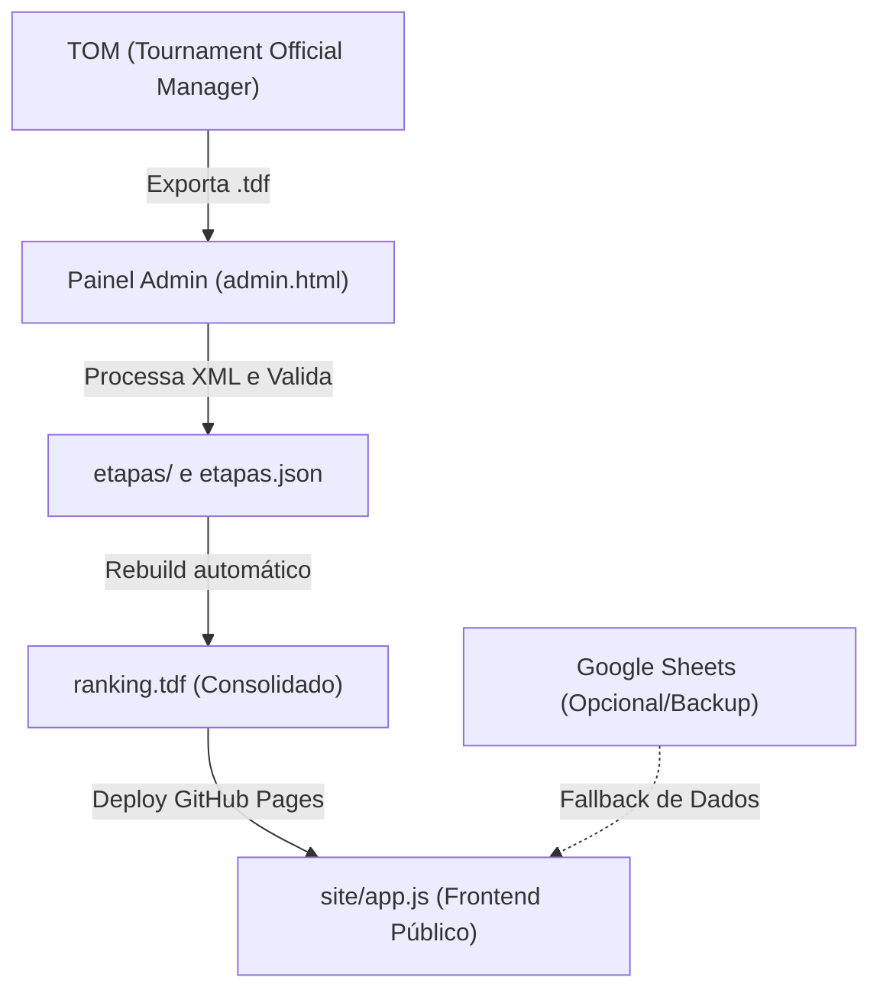
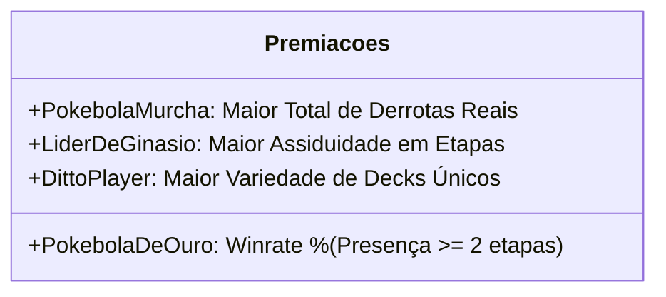

# 📖 Liga Atlântica TCG — Manual Completo de Arquitetura, Regras e Aprendizados

> **Documento Mestre de Continuidade e Referência Técnica**  
> Este documento consolida todo o conhecimento, decisões de engenharia, regras de negócio, algoritmos matemáticos e histórico de evolução do projeto **Liga Atlântica TCG**. Ele foi elaborado para servir de guia completo e permitir a retomada imediata dos trabalhos em qualquer nova máquina ou ambiente.

---

## 📑 Sumário

1. [Visão Geral do Projeto](#1-visão-geral-do-projeto)
2. [Estrutura do Repositório e Arquivos](#2-estrutura-do-repositório-e-arquivos)
3. [Fluxo de Dados e Integração](#3-fluxo-de-dados-e-integração)
4. [Regras de Negócio e Pontuação do Ranking](#4-regras-de-negócio-e-pontuação-do-ranking)
5. [Premiações Oficiais da Temporada (Cálculos Transparentes)](#5-premiações-oficiais-da-temporada)
6. [Módulo de Metagame & Gráfico em Rosca Interativo](#6-módulo-de-metagame--gráfico-em-rosca-interativo)
7. [Painel do Organizador (`admin.html`) & Leitor de TDFs do TOM](#7-painel-do-organizador-adminhtml--leitor-de-tdfs)
8. [Design System, Glassmorphism e Identidade Visual](#8-design-system-glassmorphism-e-identidade-visual)
9. [Guia de Configuração e Continuidade na Nova Máquina](#9-guia-de-configuração-e-continuidade-na-nova-máquina)

---

## 1. 🏛️ Visão Geral do Projeto

A **Liga Atlântica TCG** é um ecossistema completo para gestão de competições de **Pokémon Trading Card Game (TCG)**. Ele oferece:

* **Site Público (`site/`):** Dashboard moderno com efeito glassmorphism para consulta do Ranking Geral Consolidado, Pódios, Histórico de Etapas por Sessão, Metagame interativo com Carrossel 3D e Premiações da Temporada.
* **Painel do Organizador (`site/admin.html`):** Ferramenta web para upload e processamento direto dos arquivos `.tdf` exportados pelo software oficial **TOM (Tournament Official Manager)**, com resolução inteligente de nomes de jogadores e sincronização de ranking.
* **Scripts de Automação e Auditoria:** Scripts em Node.js e PowerShell para recalcular rankings, validar integridade e sincronizar com o repositório GitHub.

---

## 2. 🗂️ Estrutura do Repositório e Arquivos

```text
LigaAtlântica/
├── .agents/                      # Diretrizes dos Agentes AI e Skills do projeto
│   ├── AGENTS.md                 # Regras gerais de comportamento e segurança
│   └── skills/                   # Definições modulares (site_logic, ux_ui, sheets...)
├── docs/
│   └── tdfs/                     # Histórico dos arquivos .tdf originais das etapas
├── site/                         # Aplicação Frontend pública e administrativa
│   ├── index.html                # Página principal do ranking e metagame
│   ├── app.js                    # Motor JavaScript da aplicação (ranking, gráficos, modais)
│   ├── style.css                 # Folha de estilos, glassmorphism e temas de energia
│   ├── config.js                 # Constantes de configuração e URLs da planilha
│   ├── admin.html                # Painel de upload de TDFs e gestão do torneio
│   ├── ranking.tdf               # Base consolidada do ranking atual em formato TDF
│   ├── etapas.json               # Catálogo e índice de todas as etapas cadastradas
│   ├── campeoes.json             # Histórico oficial de campeões e premiações das temporadas
│   └── etapas/                   # Arquivos TDF individuais de cada etapa
├── campeoes.json                 # Cópia raiz para GitHub Pages
├── rebuild_ranking.js            # Script Node.js de reconstrução determinística do ranking
├── verify_data_integrity.js      # Script de auditoria matemática entre etapas e ranking
├── server.js                     # Servidor local de desenvolvimento
└── DOCUMENTACAO_COMPLETA_LIGA_ATLANTICA.md # Este documento mestre
```

---

## 3. 🔄 Fluxo de Dados e Integração

O sistema foi desenhado com **alta resiliência e fallback em camadas**:



1. **Fonte Primária (TDFs):** O organizador faz upload do `.tdf` gerado no evento pelo TOM. O painel extrai os resultados e atualiza o ranking consolidado.
2. **Carregamento no Site (`app.js`):** Ao abrir o site, ele consome `ranking.tdf` e `etapas.json`. Se houver integração com Google Sheets configurada em `config.js`, ela atua em conjunto ou como espelho.
3. **Cache-Busting:** As inclusões de scripts no `index.html` possuem versionamento explícito (ex: `app.js?v=7.1`) para garantir que os navegadores dos jogadores sempre recebam a versão mais recente imediatamente após o deploy.

---

## 4. ⚖️ Regras de Negócio e Pontuação do Ranking

### 4.1. Pontuação por Partida
* **Vitória ($V$):** $+3\text{ pontos}$
* **Empate ($E$):** $+1\text{ ponto}$
* **Derrota ($D$):** $+0\text{ pontos}$

### 4.2. Multiplicadores de Eventos
* **Etapa Regular de Liga:** $1.0\times$
* **League Cup / Torneio Especial:** $1.5\times$ ou $2.0\times$
* **League Challenge:** $1.5\times$

> [!IMPORTANT]
> **Regra Fundamental de Multiplicação:**
> Em eventos com multiplicadores ($1.5\times$ ou $2.0\times$), **APENAS a pontuação de torneio é multiplicada** (`Pontos += pts * mult`).
> As contagens físicas de **Vitórias, Empates e Derrotas NUNCA multiplicam** — cada derrota física sofrida na mesa soma sempre $+1$ ao histórico do jogador.

### 4.3. Pódios e Desempate
* **Pódios:** Contabiliza os jogadores que alcançaram o Top 4 na etapa.
* **Critérios de Desempate no Ranking Geral:**
  1. Maior número de **Pontos Totais**
  2. Maior número de **Pódios (Top 4)**
  3. Maior número de **Vitórias**
  4. Maior **OMW%** (Opponent Match Winrate)
  5. Menor número de **Derrotas**

---

## 5. 🏆 Premiações Oficiais da Temporada

Eliminamos quaisquer fatores artificiais ou constantes inventadas. Todas as 4 premiações utilizam **estritamente as métricas oficiais reais**:



### 1. 🥇 Pokébola de Ouro (Melhor Desempenho)
* **Conceito:** O treinador mais vitorioso e eficiente da temporada.
* **Critério Principal:** **Taxa de Vitória real (%)** ($\text{Winrate} = \frac{\text{Vitórias}}{\text{Partidas Totais}}$).
* **Filtro de Justiça:** Apenas jogadores com no mínimo **2 participações** ($\text{Participações} \ge 2$), evitando que um jogador com 100% em uma única etapa supere jogadores assíduos.
* **Critérios de Desempate Sucessivos:**
  1. Mais **Pódios (Top 4)**
  2. Mais **Vitórias Totais**
  3. Mais **Pontos na Liga**

### 2. 🥀 Pokébola Murcha (Prêmio de Consolação)
* **Conceito:** O treinador que mais acumulou derrotas nas mesas ao longo da temporada.
* **Critério Principal:** **Total Absoluto de Derrotas reais ($D$)** (número inteiro direto, sem médias fracionadas).
* **Critérios de Desempate:**
  1. Mais **Participações** (o jogador assíduo mais persistente)
  2. Menor número de Vitórias

### 3. 🥋 Líder de Ginásio (Maior Assiduidade)
* **Conceito:** O treinador mais presente nas etapas e torneios.
* **Critério Principal:** Total de **Participações (Etapas disputadas)**.
* **Critérios de Desempate:**
  1. Presenças em torneios oficiais (Cup / Challenge)
  2. Total de Pontos na Liga

### 4. 🧬 Ditto Player (Maior Variedade de Decks)
* **Conceito:** O jogador que mais pilotou arquétipos e estratégias diferentes.
* **Critério Principal:** Quantidade de **Decks Únicos** registrados nas sessões.
* **Critérios de Desempate:**
  1. Melhor **Média de Colocação** na temporada
  2. Total de Participações

---

## 6. 📈 Módulo de Metagame & Gráfico em Rosca Interativo

O módulo de Metagame no `app.js` renderiza um gráfico Doughnut customizado com tecnologia Chart.js e plugins nativos:

### 6.1. Agrupamento Automático e Drill-down
* **Filtro de $\le 1\%$ na Visão Geral:** Qualquer deck com apenas 1 aparição ou que represente **1% ou menos** do metagame é automaticamente agrupado na fatia cinza **"Outros Decks"**.
* **Exploração (*Drill-down*):** Ao clicar na fatia "Outros Decks", o gráfico expande revelando individualmente cada um dos decks menores. Uma fatia especial **"Voltar para visão geral"** permite retornar ao modo principal.

### 6.2. Precisão Decimal & Zero Colisão de Ícones
* **Eliminação do "0%":** Decks com contagens pequenas em universos grandes (ex: 1 aparição em 200 decks = 0.5%) são exibidos com fração decimal (**`0,4%`**, **`0,7%`**) em vez de arredondar para zero.
* **Algoritmo Anticolisão de Sprites:** O plugin `sliceLabels` calcula a distância euclidiana entre ícones externos. Ele testa dinamicamente 5 níveis de raios (offsets de 20px a 92px) para garantir que os sprites de Pokémon nunca se sobreponham em setores de fatias finas.

### 6.3. Gradientes Radiais por Tipo de Energia
As cores das fatias seguem rigorosamente os tipos oficiais de Pokémon TCG:
* **Grama:** `#78C850` | **Fogo:** `#FF4216` | **Água:** `#1593F5` | **Elétrico:** `#EBC816`
* **Psíquico:** `#D94293` | **Luta:** `#C55E13` | **Trevas:** `#0c4a6e` | **Metal:** `#7E8E9E`
* **Dragão:** `#8D56FF` | **Incolor:** `#e2e8f0`
* **Decks Duplos (ex: Fogo + Trevas):** Gera um **gradiente radial duplo** no Canvas 2D.

---

## 7. 🛠️ Painel do Organizador (`admin.html`) & Leitor de TDFs

O `site/admin.html` foi aprimorado para receber arquivos XML do TOM sem necessidade de conversão manual prévia.

### 7.1. Auto-detecção de Datas (`parseTDFDate`)
Resolveu o clássico conflito de localidade entre o TOM (padrão americano `MM/DD/AAAA`) e o Brasil (`DD/MM/AAAA`):
* Se o segundo número for $> 12$ (ex: `07/16/2026`), detecta automaticamente que `16` é o dia e `07` é o mês.
* Se o primeiro número for $> 12$ (ex: `16/07/2026`), detecta como dia brasileiro.
* Para datas ambíguas (ambos $\le 12$, como `06/08/2026`), o sistema aceita ambas as interpretações sem gerar avisos de divergência falsos.
* Todas as datas na interface do organizador são renderizadas no formato **`DD/MM/AAAA`**.

### 7.2. Soberania dos Resultados e Desempates Oficiais do TOM (`place`)
O software oficial **TOM (Tournament Official Manager)** da Pokémon Company calcula com precisão suíça os critérios de desempate oficiais de cada torneio (confronto direto, OMW% oficial com drops ajustados e OOMW%) e grava o resultado final na tag:
```xml
<standings>
  <pod category="2" type="finished">
    <player id="4804029" place="1"/>
    <player id="5583587" place="2"/>
    ...
  </pod>
</standings>
```
* **Regra de Ouro:** A colocação (`place`) extraída do TOM é **100% soberana** e define a posição oficial de cada jogador na etapa.
* **Proibição de Desempates Caseiros:** O leitor nunca sobrescreve o `place` oficial com fórmulas caseiras de OMW aproximado ou ordenação alfabética em etapas individuais.
* **Preservação no Site:** O motor `normalizeRanking(..., isStage=true)` no `app.js` preserva o `OriginalPos` exato da etapa, garantindo que o Campeão, Vice e demais colocações apareçam de forma idêntica ao arquivo original do TOM.

---

## 8. 🎨 Design System, Glassmorphism e Identidade Visual

* **Glassmorphism:** Efeito visual com `backdrop-filter: blur(12px)`, fundos em `rgba(255, 255, 255, 0.05)` e bordas translúcidas sutis.
* **Cabeçalho:**
  * Logotipo oficial `ligaa+.svg` inline renderizado em vetor.
  * Pokébola 3D giratória animada em CSS keyframes ao lado da marca.
* **Rodapé:** Logotipo oficial da comunidade `pokefsa.svg` integrado aos créditos institucionais.
* **Carrossel 3D de Decks:** Navegação fluida com link direto para decklists completas no **Limitless TCG**.

---

## 9. 🚀 Guia de Configuração e Continuidade na Nova Máquina

Ao transferir a pasta do projeto para a nova máquina:

### 1. Clonar ou Copiar o Repositório
```bash
git clone https://github.com/delipex/liga-atlantica.git
cd liga-atlantica
```

### 2. Rodar o Ambiente Local de Desenvolvimento
Não são necessárias dependências pesadas. Você pode usar qualquer servidor HTTP local:

* **Opção A (Node.js):**
  ```bash
  node server.js
  # ou: npx serve site
  ```
* **Opção B (Python):**
  ```bash
  python -m http.server 8000 --directory site
  ```
* **Opção C (Script de Inicialização):**
  Basta dar duplo clique em `iniciar_servidor.bat`.

### 3. Scripts de Manutenção e Auditoria
* **Reconstruir Ranking Consolidado:** `node rebuild_ranking.js`
* **Verificar Integridade dos Dados:** `node verify_data_integrity.js`

### 4. Deploy no GitHub Pages
O repositório está configurado para publicar a partir da branch `main` na raiz do GitHub Pages. Todas as atualizações sobem diretamente via commits na branch principal.

---

> ✨ **Projeto documentado e pronto para continuar evoluindo com máxima consistência e qualidade!**
