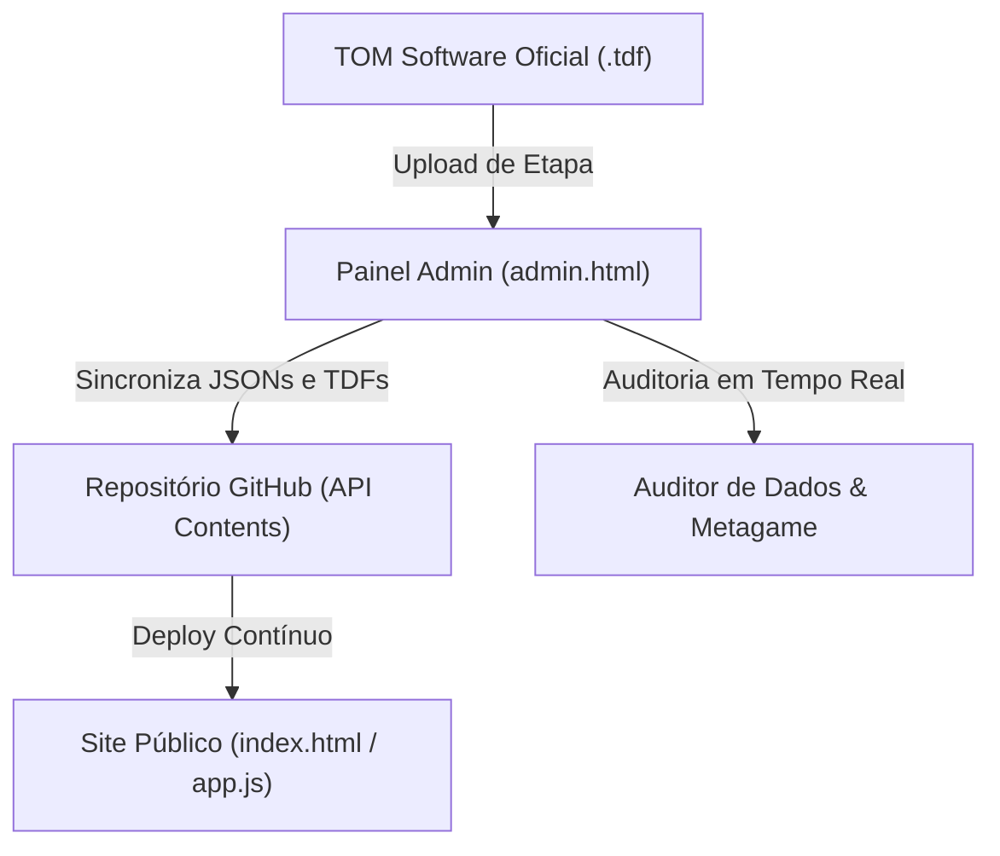
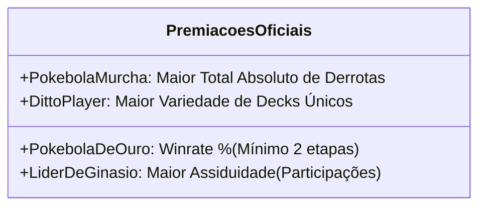

# 📖 Liga Atlântica TCG — Manual Completo de Arquitetura, Regras, Schemas e Conhecimento Mestre

> **Documento Oficial de Continuidade Técnica e Transferência de Conhecimento para IA**  
> Este documento consolida 100% do conhecimento, decisões de engenharia, regras de negócio, algoritmos matemáticos, estruturas de dados JSON/TDF e histórico de evolução do ecossistema da **Liga Atlântica TCG**.  
> Ele foi elaborado para permitir a **continuidade imediata e sem perda de contexto** em qualquer nova máquina, ambiente ou sessão com Inteligência Artificial (Google Gemini, Claude, ChatGPT, Cursor, Antigravity, etc.).

---

## 📑 Sumário

1. [Visão Geral do Ecossistema](#1-visão-geral-do-ecossistema)
2. [Estrutura Completa de Arquivos do Repositório](#2-estrutura-completa-de-arquivos-do-repositório)
3. [Arquitetura 100% Autônoma (Zero Dependência de Google Sheets)](#3-arquitetura-100-autônoma-zero-dependência-de-google-sheets)
4. [Dicionário de Dados & Schemas de Arquivos JSON e TDF](#4-dicionário-de-dados--schemas-de-arquivos-json-e-tdf)
5. [A Chave Primária Universal: POP ID (Play! Pokémon ID)](#5-a-chave-primária-universal-pop-id-play-pokémon-id)
6. [Regras de Negócio e Fórmula Matemática do Ranking](#6-regras-de-negócio-e-fórmula-matemática-do-ranking)
7. [As 4 Premiações Oficiais da Temporada (Cálculos Transparentes)](#7-as-4-premiações-oficiais-da-temporada)
8. [Módulo de Metagame, Gráfico Doughnut & Tipos de Energia](#8-módulo-de-metagame-gráfico-doughnut--tipos-de-energia)
9. [Painel do Organizador (`admin.html`) & Leitor de XML/TDF do TOM](#9-painel-do-organizador-adminhtml--leitor-de-xmltdf-do-tom)
10. [Módulo de Auditoria Profunda & Soluções Rápidas](#10-módulo-de-auditoria-profunda--soluções-rápidas)
11. [Gestão de Temporadas, Hall da Fama e Snapshot Isolado](#11-gestão-de-temporadas-hall-da-fama-e-snapshot-isolado)
12. [Segurança, Autenticação e Integração com GitHub API](#12-segurança-autenticação-e-integração-com-github-api)
13. [Design System, Glassmorphism e Identidade Visual](#13-design-system-glassmorphism-e-identidade-visual)
14. [Guia de Inicialização e Comandos na Nova Máquina](#14-guia-de-inicialização-e-comandos-na-nova-máquina)
15. [Prompt Mestre de Boot para IA (Copie e Cole em Outra Sessão)](#15-prompt-mestre-de-boot-para-ia-copie-e-cole-em-outra-sessão)

---

## 1. 🏛️ Visão Geral do Ecossistema

A **Liga Atlântica TCG** é um ecossistema web moderno e responsivo para gestão competitiva de **Pokémon Trading Card Game (TCG)** na região de Feira de Santana - BA (FSA). O projeto é composto por três pilares fundamentais:



1. **Dashboard Público (`site/index.html` + `site/app.js`):**  
   Interface premium com Glassmorphism (`backdrop-filter: blur`), Ranking Consolidado, Pódios, Histórico detalhado de cada etapa, Metagame interativo com Carrossel 3D e cálculo ao vivo das 4 premiações da temporada.
2. **Painel do Organizador (`admin.html` / `site/admin.html`):**  
   Ferramenta web completa de gestão, permitindo upload de arquivos `.tdf` do TOM, resolução inteligente de nomes, CRUD de jogadores, catálogo de decks com energias, metagame por etapa, calendário, regras, galeria, Hall da Fama de campeões e histórico de temporadas antigas com commit direto no GitHub.
3. **Auditor de Dados & Integridade de Etapas:**  
   Mecanismo de inspeção que valida $V \times 3 + E \times 1$, multiplicadores da Liga, presença de POP IDs e cobertura de decks no metagame com soluções de 1 clique.

---

## 2. 🗂️ Estrutura Completa de Arquivos do Repositório

```text
LigaAtlântica/
├── .agents/                      # Diretrizes e Skills dos Agentes de IA
│   ├── AGENTS.md                 # Regras gerais de comportamento, segurança e estilo
│   └── skills/                   # Skills especializadas (site_logic, ux_ui, etc.)
├── docs/                         # Documentações auxiliares e prompts antigos
│   └── tdfs/                     # Backups de arquivos TDF de etapas
├── site/                         # Espelho estático servido pelo GitHub Pages
│   ├── index.html                # Aplicação pública do ranking e metagame
│   ├── admin.html                # Painel de controle do organizador
│   ├── app.js                    # Motor central de renderização e lógica do site
│   ├── style.css                 # Folha de estilos, glassmorphism e temas de energia
│   ├── config.js                 # Constantes globais e versionamento
│   ├── ranking.tdf               # Ranking consolidado ativo da temporada
│   ├── etapas.json               # Índice de etapas ativas da temporada
│   ├── jogadores.json            # Base oficial de cadastros e POP IDs
│   ├── decks.json                # Catálogo de decks e tipos de energia
│   ├── metagame.json             # Registro de decks pilotados por etapa
│   ├── calendario.json           # Agenda de torneios futuros e passados
│   ├── regras.json               # Regulamento oficial da Liga Atlântica
│   ├── galeria.json              # Acervo de fotos dos eventos
│   ├── campeoes.json             # Hall da Fama de campeões históricos
│   ├── scores_antigos.json       # Colocações e decks das temporadas #1 a #4
│   ├── config.json               # Parâmetros gerais (pódio, status, metagame)
│   └── etapas/                   # Arquivos TDF originais individuais (AAAA-MM-DD.tdf)
├── ranking.tdf                   # Cópia raiz para leitura direta
├── etapas.json                   # Cópia raiz
├── jogadores.json                # Cópia raiz
├── decks.json                    # Cópia raiz
├── metagame.json                 # Cópia raiz
├── calendario.json               # Cópia raiz
├── regras.json                   # Cópia raiz
├── galeria.json                  # Cópia raiz
├── campeoes.json                 # Cópia raiz
├── scores_antigos.json           # Cópia raiz
├── config.json                   # Cópia raiz
├── etapas/                       # Pasta raiz com arquivos TDF das etapas
├── temporadas/                   # Snapshots arquivados de temporadas anteriores
│   ├── temporada-1/              # Ex: ranking_final.tdf, etapas.json, resumo.json
│   ├── temporada-2/
│   ├── temporada-3/
│   └── temporada-4/
├── server.js                     # Servidor local de desenvolvimento
├── rebuild_ranking.js            # Script utilitário para recálculo via terminal
├── verify_data_integrity.js      # Script de auditoria matemática via terminal
└── DOCUMENTACAO_COMPLETA_LIGA_ATLANTICA.md # Este documento mestre
```

---

## 3. 🌐 Arquitetura 100% Autônoma (Zero Dependência de Google Sheets)

O sistema foi **completamente desacoplado de planilhas Google Sheets**, eliminando gargalos de rede, limites de cota da Google API, necessidade de autenticação OAuth2 e dependência de serviços externos que causavam indisponibilidade.

* **Persistência Baseada em Arquivos:** Toda a base de dados reside em arquivos JSON e TDF versionados no Git.
* **Leitura Direta:** O site público (`app.js`) carrega os arquivos com `fetch('arquivo.json?v=timestamp')` de forma instantânea e estática.
* **Gravação Instantânea via GitHub API:** O painel administrativo (`admin.html`) realiza commits seguros na branch `main` utilizando a API oficial de conteúdos do GitHub (`https://api.github.com/repos/:owner/:repo/contents/:path`).
* **Sincronização Bidirecional:** Qualquer alteração feita visualmente pelo admin reflete instantaneamente no site público após o deploy do GitHub Pages.

---

## 4. 📊 Dicionário de Dados & Schemas de Arquivos JSON e TDF

### 4.1. `jogadores.json` — Base Oficial de Jogadores
```json
[
  {
    "ID": "5374806",
    "Jogador": "Washington Neto",
    "Categoria": "Master",
    "PosicaoFinal": "1º",
    "Foto": "https://...",
    "Deck": "Dragapult ex"
  }
]
```

### 4.2. `decks.json` — Catálogo Oficial de Decks
```json
[
  {
    "deck": "Dragapult ex",
    "tipoEnergia": "psychic+fire",
    "imagem": "https://...",
    "limitless": "https://limitlesstcg.com/decks/...",
    "icone": "https://..."
  }
]
```
* **Tipos de Energia Aceitos:** `grass`, `fire`, `water`, `lightning`, `psychic`, `fighting`, `darkness`, `metal`, `dragon`, `colorless`.  
* **Energias Duplas/Híbridas:** Aceita formato `energia1+energia2` (ex: `psychic+fire`, `darkness+poison`, `water+fighting`), gerando gradiente visual no badge.

### 4.3. `metagame.json` — Registro de Decks por Etapa
```json
{
  "2026-08-29": {
    "sessionCode": "Etapa 15",
    "decks": {
      "Washington Neto": "Zoroark ex",
      "Igor Nunes": "Mega Sharpedo",
      "Carlos Junior": "Lugia Archeops"
    }
  }
}
```

### 4.4. `etapas.json` — Índice de Etapas da Temporada
```json
[
  {
    "data": "2026-08-29",
    "tipo": "Cup",
    "multiplicador": 1.5,
    "temporada": 5,
    "sessao": 15
  }
]
```

### 4.5. `campeoes.json` — Hall da Fama de Campeões Históricos
```json
[
  {
    "Temporada": "Temporada #4",
    "Campeao": "Washington Neto",
    "Vice": "Igor Nunes",
    "DeckCampeao": "Zoroark ex",
    "Data": "junho/2026",
    "FotoCampeao": "https://...",
    "URLDeck": "",
    "ImagemDeck": "https://...",
    "ObservacaoDeck": "Estratégia veloz com Zoroark ex.",
    "PokebolaOuro": "Washington Neto",
    "LiderGinasio": "Carlos Paes",
    "DittoPlayer": "Carlos Morais",
    "PokebolaMurcha": "Wesllen Dias"
  }
]
```

### 4.6. `scores_antigos.json` — Histórico de Colocações das Temporadas Passadas
```json
[
  {
    "temporada": "Temporada #3",
    "dataFechamento": "11-04-2026",
    "pos": 1,
    "jogador": "João Pedro Oliveira",
    "categoria": "ME",
    "pontos": "320",
    "deck": "Mega Sharpedo"
  }
]
```

### 4.7. `ranking.tdf` — Ranking Consolidado Ativo (TSV Tab-Separated)
Cabeçalho obrigatório separado por tabulações (`\t`):
```text
Pos	ID	Jogador	Categoria	Pontos	Vitorias	Empates	Derrotas	Podio	MediaColocacao	Participacoes	HistoricoColocacoes
1	5374806	Washington Neto	MASTER	385	32	4	6	12	2.15	15	1;1;2;1;3;1;1;2;1;4;1;2;1;1;1
```

### 4.8. `etapas/AAAA-MM-DD.tdf` — Arquivo Original de Cada Etapa (XML ou TSV do TOM)
Contém os resultados exportados pelo TOM. Preservado estritamente como **somente-leitura**.

---

## 5. 🔑 A Chave Primária Universal: POP ID (Play! Pokémon ID)

> [!IMPORTANT]
> **Princípio Inquebrável de Arquitetura de Dados da Liga:**
> Nomes de jogadores sofrem variações naturais entre eventos: acentos omitidos (`Joao` vs `João`), sobrenomes abreviados (`Caio R.` vs `Caio Rios`) ou grafias diferentes digitadas em computadores de organizadores distintos.  
> **O POP ID (Play! Pokémon ID) NUNCA MUDA**. Ele é a âncora e chave primária absoluta de toda a integridade do sistema.

### 5.1. Mecanismo de Resolução em Três Etapas:
1. **Busca por POP ID:** Se a linha possui ID, busca o jogador cadastrado com o mesmo ID em `jogadores.json`. Encontrando, adota o nome oficial padronizado.
2. **Busca por Nome Normalizado:** Remove acentuações, espaços extras e converte para minúsculas (`normalizePlayerName`).
3. **Resolução Interativa no Admin:** Se um jogador novo for detectado sem ID e sem correspondência exata, a tabela de **Resolução de Nomes** do admin permite vincular ao cadastro existente ou cadastrar o novo jogador com 1 clique antes da publicação.

---

## 6. ⚖️ Regras de Negócio e Fórmula Matemática do Ranking

### 6.1. Pontuação por Partida (Padrão TOM)
* **Vitória ($V$):** $+3\text{ pontos}$
* **Empate ($E$):** $+1\text{ ponto}$
* **Derrota ($D$):** $+0\text{ pontos}$

### 6.2. Multiplicadores de Eventos
* **Sessão Regular de Liga:** $1.0\times$
* **League Challenge:** $1.5\times$
* **League Cup:** $1.5\times$
* **Eventos Especiais / Finais:** $1.5\times$, $2.0\times$ ou personalizado.

> [!WARNING]
> **Regra Fundamental de Multiplicação:**
> Em eventos com multiplicador ($1.5\times$ ou $2.0\times$), **APENAS a pontuação de torneio é multiplicada**:
> $$\text{Pontos Ganha na Etapa} = ((V \times 3) + (E \times 1)) \times \text{Multiplicador}$$
> As contagens físicas de **Vitórias, Empates e Derrotas NUNCA multiplicam**. Cada vitória sofrida na mesa é sempre $+1$ vitória, e cada derrota é $+1$ derrota.

### 6.3. Critérios Oficiais de Desempate do Ranking Geral:
1. Maior número de **Pontos Totais**
2. Maior número de **Pódios (Top 4)**
3. Menor **Média de Colocação** ($\text{MediaColocacao} = \frac{\sum \text{Colocações}}{\text{Participações}}$)
4. Ordem alfabética pelo nome oficial

---

## 7. 🏆 As 4 Premiações Oficiais da Temporada

Todas as 4 premiações utilizam métricas reais consolidadas, sem números mágicos ou fatores artificiais:



### 1. 🥇 Pokébola de Ouro (Melhor Aproveitamento)
* **Conceito:** O treinador com maior índice de eficiência e vitórias.
* **Fórmula Principal:** $\text{Taxa de Vitória (\%)} = \frac{V}{V + E + D} \times 100$.
* **Filtro de Elegibilidade:** Mínimo de **2 participações** na temporada ($\text{Participações} \ge 2$).
* **Desempate:** Mais Pódios $\rightarrow$ Mais Vitórias $\rightarrow$ Mais Pontos na Liga.

### 2. 🥀 Pokébola Murcha (Prêmio de Consolação)
* **Conceito:** O treinador que mais enfrentou partidas difíceis e acumulou derrotas nas mesas.
* **Fórmula Principal:** **Total Absoluto de Derrotas Físicas ($D$)** (número inteiro).
* **Desempate:** Mais Participações (o jogador mais persistente) $\rightarrow$ Menos Vitórias.

### 3. 🥋 Líder de Ginásio (Maior Assiduidade)
* **Conceito:** O treinador mais fiel e presente em todas as etapas da Liga.
* **Fórmula Principal:** Total de **Participações (Etapas disputadas)**.
* **Desempate:** Mais Pódios $\rightarrow$ Total de Pontos na Liga.

### 4. 🧬 Ditto Player (Maior Variedade de Decks)
* **Conceito:** O jogador mais camaleônico, que pilotou o maior número de arquétipos diferentes.
* **Fórmula Principal:** Contagem de **Decks Únicos** registrados nas sessões através do `metagame.json`.
* **Desempate:** Melhor Média de Colocação $\rightarrow$ Mais Participações.

---

## 8. 📈 Módulo de Metagame, Gráfico Doughnut & Tipos de Energia

### 8.1. Gráfico Doughnut Interativo (Chart.js)
* **Filtro $\le 1\%$:** Decks com representação $\le 1\%$ são agrupados automaticamente na fatia **"Outros Decks"**.
* **Drill-down:** Clicar na fatia "Outros Decks" abre a visão expandida detalhando cada deck individual. Uma fatia central permite voltar à visão geral.
* **Plugin Anticolisão de Sprites:** O plugin customizado calcula distâncias euclidianas e afasta os ícones de Pokémon radialmente para evitar sobreposições visuais em fatias finas.

### 8.2. Mapeamento de Tipos de Energia Pokémon
```javascript
const ENERGY_CONFIG = {
  grass:     { label: "Planta",    color: "#78C850", dot: "🟢" },
  fire:      { label: "Fogo",      color: "#FF4216", dot: "🔴" },
  water:     { label: "Água",      color: "#1593F5", dot: "🔵" },
  lightning: { label: "Elétrico",  color: "#EBC816", dot: "🟡" },
  psychic:   { label: "Psíquico",  color: "#D94293", dot: "🟣" },
  fighting:  { label: "Lutador",   color: "#C55E13", dot: "🟤" },
  darkness:  { label: "Sombrio",   color: "#0c4a6e", dot: "⚫" },
  metal:     { label: "Metal",     color: "#7E8E9E", dot: "🔘" },
  dragon:    { label: "Dragão",    color: "#8D56FF", dot: "🟣" },
  colorless: { label: "Incolor",   color: "#94a3b8", dot: "⚪" }
};
```

---

## 9. 🛠️ Painel do Organizador (`admin.html`) & Leitor de XML/TDF do TOM

### 9.1. Leitura Nativa do TOM
O leitor processa diretamente a estrutura XML de standings oficiais do TOM:
```xml
<standings>
  <pod category="2" type="finished">
    <player id="5374806" place="1"/>
    <player id="4804029" place="2"/>
  </pod>
</standings>
```
* **Soberania do `place` Oficial:** A colocação do TOM define a posição oficial da etapa, sem recálculos arbitrários que alterem campeões e vices.

### 9.2. Auto-detecção de Datas (`parseTDFDate`)
Resolve automaticamente o conflito entre o formato americano (`MM/DD/AAAA`) gerado pelo software e o formato brasileiro (`DD/MM/AAAA`).

---

## 10. 🔍 Módulo de Auditoria Profunda & Soluções Rápidas

### 10.1. Filosofia de Auditoria
> [!NOTE]
> Os arquivos `.tdf` na pasta `etapas/` são **fontes primárias de verdade e somente-leitura**. O auditor inspeciona a coerência entre os arquivos brutos, as regras da liga e o ranking final consolidado.

### 10.2. Relação TOM vs Liga Atlântica:
* **No arquivo da etapa (`etapas/AAAA-MM-DD.tdf`):** Armazena os pontos brutos calculados pelo TOM ($6\text{V} - 2\text{E} = 20\text{ PTS}$).
* **No Ranking da Liga:** Aplica o multiplicador da temporada ($20 \times 1.5 = 30\text{ PTS}$).
* **Auditor Inteligente:** Reconhece essa relação e exibe `20 PTS (TOM) → 30 PTS na Liga (1.5x)` em verde $\checkmark$ como **100% íntegro**.

### 10.3. Soluções e Ações com 1 Clique:
* **`🎴 Atribuir Decks no Metagame`:** Abre a aba Metagame com a etapa já selecionada para atribuição manual.
* **`✨ Auto-Preencher Decks Conhecidos`:** Varre o histórico do jogador em outras sessões e preenche os decks ausentes no `metagame.json` salvando no GitHub.
* **`⚡ Recalcular & Sincronizar Ranking Geral`:** Reconstrói o `ranking.tdf` consolidado somando todas as etapas ativas do zero com multiplicadores oficiais.

---

## 11. 🏆 Gestão de Temporadas, Hall da Fama e Snapshot Isolado

### 11.1. Hall da Fama de Campeões (`campeoes.json`)
CRUD visual no `admin.html` (aba *🏆 Temporadas*) com modais para cadastrar, editar foto, deck campeão e os vencedores dos 4 títulos da temporada.

### 11.2. Scores Antigos (`scores_antigos.json`)
Consulta, edição e exclusão das colocações, categorias, pontos e decks das temporadas anteriores (#1 a #4).

### 11.3. Encerramento Seguro de Temporada (Snapshot Isolado)
Ao finalizar uma temporada vigente via modal protegido por senha SHA-256:
1. Cria snapshot permanente em `temporadas/temporada-N/`:
   * `ranking_final.tdf`
   * `etapas.json`
   * `resumo.json` (com campeão, total de etapas, total de jogadores)
   * Cópia de todos os `.tdf` individuais em `temporadas/temporada-N/etapas/`
2. Registra o Campeão no Hall da Fama (`campeoes.json`).
3. Limpa a pasta `etapas/` e zera `ranking.tdf` para a nova temporada.

---

## 12. 🔒 Segurança, Autenticação e Integração com GitHub API

* **Autenticação no Painel:** Validação de senha através de hash SHA-256 (`crypto.subtle.digest('SHA-256')`).
* **Ofuscação de Token:** O token do GitHub é armazenado com criptografia XOR e descriptografado em memória de runtime apenas após login bem-sucedido.
* **Operações no GitHub:** Todas as alterações realizam commit via API REST:
  1. `GET` na URL do arquivo para obter o `sha` mais recente.
  2. `PUT` com payload `{ message, content: encodeBase64UTF8(json), sha, branch: "main" }`.

---

## 13. 🎨 Design System, Glassmorphism e Identidade Visual

* **Efeito Glassmorphism:** `backdrop-filter: blur(12px)`, `background: rgba(15, 23, 42, 0.75)`, bordas translúcidas sutis `rgba(255, 255, 255, 0.08)`.
* **Cores Principais:**
  * Amarelo Poké: `#FFCB05` (Accent Yellow)
  * Azul Noturno: `#0f172a` (Background Dark)
  * Azul Atlântico: `#2563eb` (Primary Blue)
  * Verde Sucesso: `#10b981`
  * Vermelho Alerta: `#ef4444`
* **Pódios:** 1º Ouro (`#FFD700`), 2º Prata (`#C0C0C0`), 3º Bronze (`#CD7F32`), 4º Top 4 (`#818cf8`).

---

## 14. 💻 Guia de Inicialização e Comandos na Nova Máquina

```bash
# 1. Clonar o repositório
git clone https://github.com/delipex/liga-atlantica.git
cd liga-atlantica

# 2. Executar Servidor Local (Node.js ou Python)
node server.js
# Ou: python -m http.server 8000 --directory site

# 3. Scripts Utilitários
node rebuild_ranking.js          # Recalcula ranking.tdf a partir das etapas
node verify_data_integrity.js    # Executa auditoria matemática via terminal
```

---

## 15. 🤖 Prompt Mestre de Boot para IA (Copie e Cole em Outra Sessão)

> [!TIP]
> **Instrução para o Usuário:**  
> Quando for iniciar uma nova conversa com qualquer IA em outro computador, copie e cole o bloco delimitado abaixo como sua primeira mensagem. A IA entenderá imediatamente todo o projeto e suas regras:

```markdown
Você é o assistente técnico sênior e desenvolvedor da **Liga Atlântica TCG**, um ecossistema web para gerenciamento de competições de Pokémon TCG.

Aqui está o contexto completo da arquitetura e regras de negócio:
1. ARQUITETURA 100% AUTÔNOMA: O sistema não usa Google Sheets. Toda a base de dados reside em arquivos JSON e TDF no repositório GitHub (jogadores.json, decks.json, metagame.json, calendario.json, regras.json, galeria.json, campeoes.json, scores_antigos.json, config.json, etapas.json, ranking.tdf).
2. CHAVE PRIMÁRIA ABSOLUTA: O POP ID (Play! Pokémon ID) é a chave primária imutável. Nomes podem variar entre etapas/PCs, mas o ID nunca muda e define a identidade do jogador.
3. REGRAS DE PONTUAÇÃO: Vitória = +3 pts, Empate = +1 pt, Derrota = 0 pts. Em torneios com multiplicador (1.5x ou 2.0x), APENAS os pontos são multiplicados (Pontos = (V*3 + E*1) * Mult). As contagens físicas de Vitórias, Empates e Derrotas NUNCA se multiplicam.
4. ARQUIVOS TDF DO TOM: Os arquivos em etapas/AAAA-MM-DD.tdf vêm do TOM e são somente-leitura. O TOM grava pontos brutos (ex: 20 pts); a Liga calcula a pontuação ponderada (ex: 30 pts com 1.5x) no ranking consolidado.
5. PREMIAÇÕES OFICIAIS:
   - Pokébola de Ouro: Maior Taxa de Vitórias % (V / Total) com mínimo de 2 etapas disputadas.
   - Pokébola Murcha: Maior total absoluto de Derrotas físicas reais.
   - Líder de Ginásio: Maior número de participações em etapas.
   - Ditto Player: Maior número de decks únicos pilotados na temporada (via metagame.json).
6. DESIGN SYSTEM: Dark mode, glassmorphism (backdrop-filter: blur), badges com gradientes baseados nos tipos oficiais de energia Pokémon.
7. PAINEL ADMIN (admin.html): Possui CRUD visual completo, leitor de TDFs do TOM, Auditoria com soluções em 1 clique, gerenciamento de Hall da Fama, scores antigos e arquivamento de temporada com snapshots em temporadas/temporada-N/.

Por favor, confirme que você compreendeu essas regras e está pronto para nos ajudar com o código e manutenção da Liga Atlântica TCG.
```

---

> ✨ **Documento Mestre concluído com sucesso. A Liga Atlântica TCG está 100% documentada, segura e pronta para continuar evoluindo em qualquer ambiente!**
